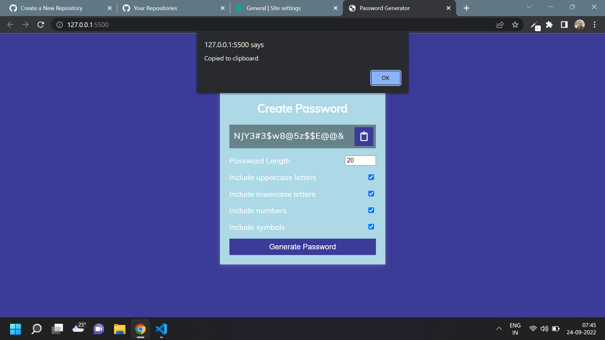

# Javascript Assignment Password Generator

## Password Generator [Live Link](https://password-generatorr-js.netlify.app/)

- Skills Gained in this project

  - copy text to clipboard

  - generate random password string thorugh Math.random and arrays

---

## Time taken to finish this project

- 1 hour 30 minutes to complete it

#### Screenshot

